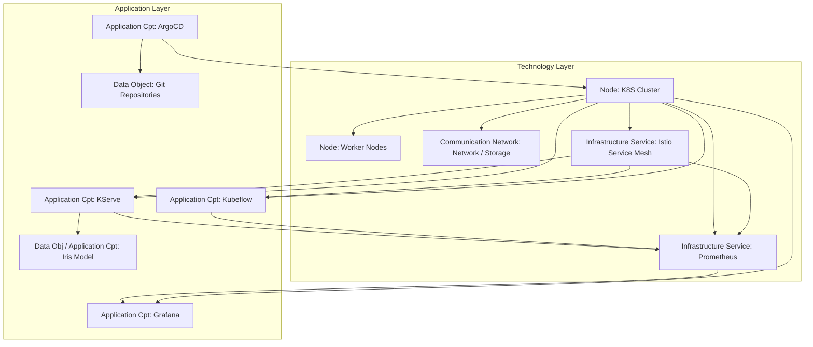

# Kubernetes MLOps Platform: Complete Architecture


# Table of Contents

1. Objective ..................................................................... 1
2. Global Architecture ........................................................... 1
3. Key Components ................................................................ 2
4. Deployment Steps .............................................................. 2
   
    4.1 Prepare Kubernetes ........................................................ 2
   
    4.2 Install cert-manager ...................................................... 3
   
    4.3 Upgrade Kustomize ......................................................... 3
   
    4.4 Install Istio ............................................................. 4
   
    4.5 Install KServe ............................................................ 4
   
    4.6 Verify Installation ....................................................... 5
   
    4.7 Install Kubeflow .......................................................... 5
   
    4.8 Deploy Sample Model (KServe) .............................................. 6
   
    4.9 Deployment Validation ..................................................... 6
   
6. Install Argo CD ............................................................... 7
7. Monitoring and Observability .................................................. 7
8. Multi-tenancy and Security .................................................... 8
9. Standard MLOps Pipeline ....................................................... 8
10. Final Checks .................................................................. 9
11. Best Practices ................................................................ 9
    
# Kubernetes MLOps Platform: Complete Architecture

## 1. Objective
Transform a basic Kubernetes cluster into a comprehensive MLOps platform integrating Kubeflow, KServe, ArgoCD/Argo Rollouts, monitoring, multi-tenancy, and security.



## 2. Global Architecture
Logical cluster structure:
Kubernetes Cluster
istio-system: istiod (Ingress / Routing)
cert-manager: TLS Certificates and Webhooks
kubeflow: Dashboard, Pipelines, Katib, Notebooks
kserve: Model management (InferenceServices)
ml: Production namespace for models
argocd: GitOps automation
monitoring: Prometheus, Grafana, Kiali

## 3. Key Components
# Key Components

| Component          | Role                                             |
|-------------------|--------------------------------------------------|
| Istio             | Ingress, service mesh, routing for KServe & Kubeflow |
| Cert-manager      | TLS management and webhook certificates         |
| Kubeflow Pipelines| ML workflow orchestration (DAG)                 |
| Katib             | AutoML and hyperparameter tuning               |
| KServe            | Highly scalable model deployment (Serving)     |
| Argo CD           | Continuous deployment via GitOps               |
| Prometheus / Grafana | System and application metrics               |


## 4. Deployment Steps
### 4.1 Prepare Kubernetes
Ensure your cluster meets the following prerequisites:
Version $\ge$ v1.24
cluster-admin privileges
Dynamic storage configured (StorageClass)
### 4.2 Install cert-manager
### Installation de cert-manager
```txt
kubectl apply -f [https://github.com/cert-manager/cert-manager/releases/latest/download/cert-manager.yaml](https://github.com/cert-manager/cert-manager/releases/latest/download/cert-manager.yaml)
```
### Vérification (doit être en statut Running)
```txt
kubectl get pods -n cert-manager
pod/cert-manager-7844dc6b64-8q2st 1/1 Running 0 45s
```

### 4.3 Upgrade Kustomize
```txt
mkdir -p /opt/automation/kustomize && cd /opt/automation/kustomize
VERSION=v5.2.1
wget [https://github.com/kubernetes-sigs/kustomize/releases/download/kustomize%2F$VERSION/kustomize] \
(https://github.com/kubernetes-sigs/kustomize/releases/download/kustomize%2F$VERSION/kustomize)_{$VERSION}_linux_amd64.tar.gz
tar -xvf kustomize_{$VERSION}_linux_amd64.tar.gz
sudo mv kustomize /usr/local/bin/
kustomize version
```

### 4.4 Install Istio
```txt
mkdir /opt/automation/istio
cd /opt/automation/istio
curl -L https://github.com/istio/istio/releases/download/1.28.3/istio-1.28.3-linux-amd64.tar.gz -o istio-1.28.3.tar.gz
helm install istio-base istio/base -n istio-system
helm install istio-ingress istio/gateway -n istio-system --wait
helm install istiod istio/istiod -n istio-system --wait


curl -L https://istio.io/downloadIstio >istioctl.sh
tar zxvf istio-1.28.3.tar.gz
kubectl create namesapce istio-systems

 istioctl x precheck
✔ No issues found when checking the cluster. Istio is safe to install or upgrade!
  To get started, check out https://istio.io/latest/docs/setup/getting-started/.

. ./istioctl.sh

istioctl install --set profile=default -y
```

### 4.5 Install KServe
```
 kubectl apply -f [https://github.com/kserve/kserve/releases/latest/download/kserve.yaml](https://github.com/kserve/kserve/releases/latest/download/kserve.yaml)
```

### 4.6 Verify Installation
```txt
kubectl get crd | grep inferenceservice
inferenceservices.serving.kserve.io 2026-01-20T12:00:00Z
```

### 4.7 Install Kubeflow
```txt
git clone [https://github.com/kubeflow/manifests.git](https://github.com/kubeflow/manifests.git)
cd manifests
while ! kustomize build example | kubectl apply -f -; do sleep 10; done
```

### 4.8 Deploy Sample Model
```txt
Fichier iris.yaml :
apiVersion: serving.kserve.io/v1beta1
kind: InferenceService
metadata:
  name: iris
  namespace: ml
spec:
  predictor:
    sklearn:
      storageUri: gs://kfserving-examples/models/sklearn/1.0/model
```

### 4.9 Deployment Validation
```txt
kubectl apply -f iris.yaml
kubectl get inferenceservice iris -n ml
```

## 5. Install Argo CD
```txt
kubectl create namespace argocd
argo/argo-cd                            3.35.4          v2.2.5          A Helm chart for ArgoCD, a declarative, GitOps ...
```


## 6. Monitoring and Observability
Prometheus/Grafana : Métriques de performance.
Kiali : Visualisation du Service Mesh Istio.

## 7. Multi-tenancy and Security
Utilisation de Kubeflow Profiles pour l'isolation.
RBAC strict par namespace.
TLS automatique via cert-manager.

## 8. Standard MLOps Pipeline
Training : Kubeflow Pipelines.
Storage : Modèle poussé sur S3/GCS.
Deployment : Argo CD détecte le changement de manifest.
Serving : KServe expose l'InferenceService.

## 9. Final Checks
Vérifier que les Pods sont en état Running.
Valider l'Ingress Istio.

## 10. Best Practices
Isolation stricte Dev/Prod.
Utilisation du Scale-to-zero pour économiser les coûts.
Tests automatisés avant promotion.

