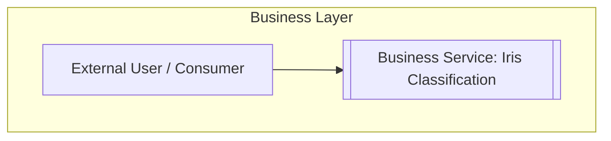
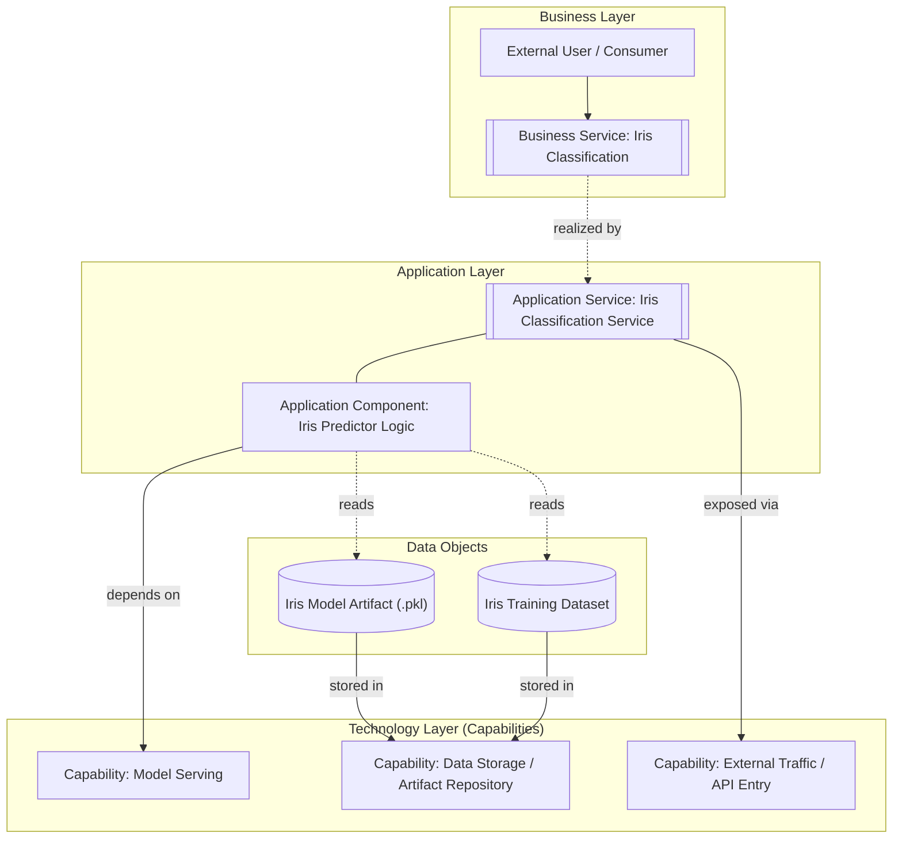
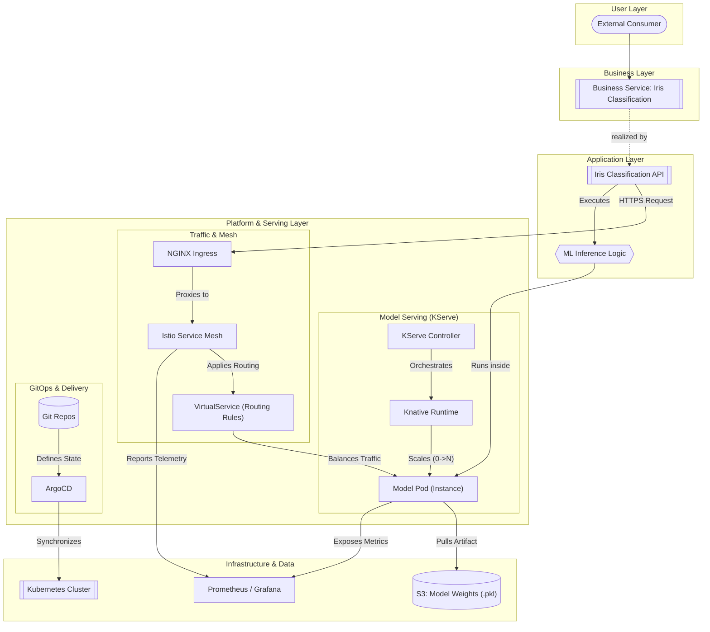

# From Business Vision to DevOps: Modeling an Iris Classification Use Case Across the TOGAF ADM Cycle

In modern enterprise architecture, **having a structured approach to modeling systems is crucial**. One of the challenges many organizations face is the **lack of clarity in representing Business, Application, and Technology layers**. Without disciplined modeling, these layers often become a **jumbled mix of concepts, components, and technologies**, resulting in diagrams that are difficult to interpret and misalign stakeholders.

The **TOGAF Architecture Development Method (ADM)** provides a **step-by-step framework** to ensure architectural work remains consistent and traceable, from **high-level business objectives** down to **solution deployment and operational readiness**. At each phase of the ADM cycle, specific **artefacts and diagrams** help communicate the design:

- **Phase A & B (Architecture Vision and Business Architecture)**: Focus on the **business service, stakeholders, and objectives**. Artefacts highlight the value delivered to users and the processes that support it.
- **Phase C (Information Systems & Data Architecture)**: Represent **application components, data objects, and technology capabilities**. Diagrams clarify how business services are realized in terms of applications and data.
- **Phase D & E (Technology Architecture and Opportunities / Solutions)**: Detail the **platform, runtime, and infrastructure layers**, providing visibility on **deployment, scaling, and observability**. Artefacts support DevOps teams by linking conceptual models to deployable solutions.

Throughout these phases, **visual clarity is key**. The **relationships between business services, application components, and technology capabilities** must be explicit, showing not just the components but **how they interact, realize, and depend on one another**.

From an **architectural perspective**, it is essential to **avoid overloading diagrams with secondary or repetitive details**. In this use case, we have **explicitly excluded the operational steps of training the Iris model**. While training is a critical ML process, including it in the diagrams would introduce **additional components and interactions** that are **not central to understanding the realization of the business service and its deployment**. This selective abstraction is part of my IT architecture approach: **focus on clarity, traceability, and the evolution of the architecture, rather than modeling every operational detail**.

An additional challenge is **audience comprehension**. Architects (“purists”) may value **semantic accuracy and formal representations**, while developers and DevOps teams often need **practical clarity for implementation and operations**. Therefore, it is important to **seek feedback from both groups** to ensure that diagrams communicate effectively **without losing rigor**, and that subtleties in the representation of the three layers are understood at every phase of the ADM cycle.

To illustrate this approach, we use a **practical example: an Iris Classification ML service**. This use case is simple enough to follow through all ADM phases, yet **rich enough to demonstrate the evolution of the architecture from business vision to deployed, observable service**. We will present diagrams for **each phase**, showing **how the business layer, application layer, and technology layer are progressively elaborated**, and highlighting the **key artefacts and relationships**.

---

## 1️⃣ Phases A & B – Architecture Vision & Business Architecture

- **Phase A (Architecture Vision)**: Define the **high-level business objectives** and the **scope of the Iris Classification service**. Focus on **stakeholders, external users, and business value**.
- **Phase B (Business Architecture)**: Map **business processes and services** to support these objectives.

For our use case:  

- **Business Layer**: “Iris Classification” as a **business service** consumed by external users.
- At this stage, the **application and technology layers are abstract**, ensuring we understand the **business needs** before technical design.

**Diagram (Business Layer / Vision):**



## 2️⃣ Phase C – Information Systems & Data Architecture

Phase C focuses on **Application and Data Architecture**, while keeping strong **business alignment**.

- **Business Layer**: Maintains the **Iris Classification service**, linked to external users.
- **Application Layer**: The **Iris Classification API** and **predictor logic component**.
- **Data Layer**: The **Iris Model Artifact (.pkl)** and the **training dataset**.
- **Technology Layer (Capabilities)**: Abstract capabilities like **Model Serving**, **Data Storage**, **API Entry** — no runtime specifics yet.

**Phase C Diagram – Conceptual / Information Systems:**



## 3️⃣ Phases D & E – Technology Architecture & Opportunities / Solutions

Phases D and E detail **how the solution is realized and deployed**, moving from **conceptual to operational**.

- **Business Layer**: Minimal — keep the **external user** and the **Iris Classification service** for traceability.
- **Application Layer**: API and ML inference logic, now considered **deployable artifacts**.
- **Platform / Runtime Layer**: Kubernetes cluster, **KServe**, **Knative**, **NGINX Ingress**, **Istio Service Mesh**, ArgoCD/GitOps.
- **Infrastructure & Observability**: Pods running the model, S3 storage for model weights, monitoring via Prometheus/Grafana.

**Phase D/E Diagram – Solution & DevOps Ready:**
```

